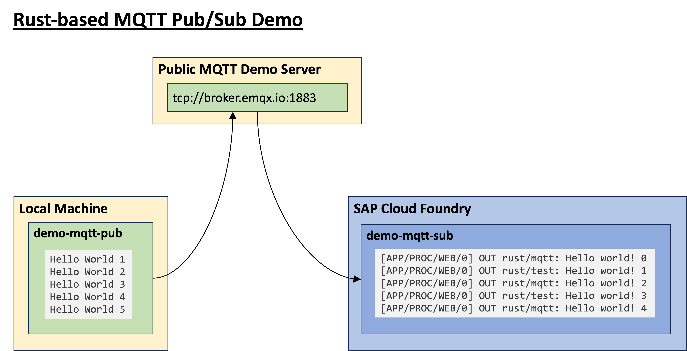

# MQTT Publisher Example App

A simple Rust-based app that publishes messages to the public MQTT server at `tcp://broker.emqx.io:1883`

This app works with in conjunction with a corresponding subscriber app.

## Usage

1. Compile with `cargo build --release`
1. Start publisher `./target/release/mqtt-pub`

The publisher then issue 5 messages and terminates

| Publisher | Subscriber
|---|---
| | Processing requests...
| Publishing messages on topic "rust/mqtt" | rust/mqtt: Hello world! 0
| Publishing messages on topic "rust/test" | rust/test: Hello world! 1
| Publishing messages on topic "rust/mqtt" | rust/mqtt: Hello world! 2
| Publishing messages on topic "rust/test" | rust/test: Hello world! 3
| Publishing messages on topic "rust/mqtt" | rust/mqtt: Hello world! 4

Press `ctrl c` to terminate the subscriber
